# Taller 1: Construcción de Pipelines en Cloud

**Repositorio:** https://github.com/Electromayonaise/microservices-demo
**Fecha de presentación:** 13 de abril de 2026
**Metodología ágil:** Kanban

---

## 1. Estrategia de Branching para Desarrolladores (2.5%)

Se implementó **Gitflow** como estrategia de branching para desarrolladores.

Documentación completa: [branching-strategy.md](./branching-strategy.md)

### Ramas creadas

| Rama | Propósito |
|------|-----------|
| `main` | Código en producción |
| `develop` | Rama de integración |
| `feature/*` | Nuevas funcionalidades (temporales) |
| `release/*` | Preparación de versiones (temporales) |
| `hotfix/*` | Fixes urgentes en producción (temporales) |

### Protecciones configuradas

- Push directo a `main` bloqueado — solo vía Pull Request
- Se requiere mínimo 1 aprobación para mergear a `main`

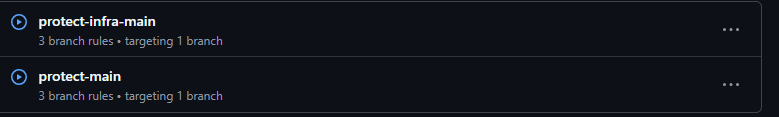

---

## 2. Estrategia de Branching para Operaciones (2.5%)

Se implementó **GitOps** como estrategia de branching para operaciones de infraestructura.

Documentación completa: [branching-strategy.md](./branching-strategy.md#2-estrategia-para-operaciones--gitops)

### Ramas creadas

| Rama | Propósito |
|------|-----------|
| `infra/main` | Estado de infraestructura en producción |
| `infra/staging` | Cambios de infraestructura en validación |
| `infra/feature/*` | Cambios de infra en desarrollo (temporales) |

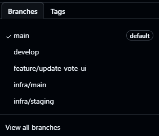

---

## 3. Patrones de Diseño de Nube (15%)

Se documentaron e implementaron 5 patrones. Documentación completa: [cloud-patterns.md](./cloud-patterns.md)

### Patrones existentes (documentados)

| Patrón | Descripción |
|--------|------------|
| **Microservicios** | 3 servicios independientes (vote, worker, result) con Dockerfile y Helm chart propio |
| **Cola de Mensajes / Event-Driven** | Kafka desacopla vote (productor) de worker (consumidor) |
| **Retry** | worker y result reintentan la conexión a Kafka y PostgreSQL hasta que estén disponibles |

### Patrones implementados

#### 4. Config Externalization

Configuración externalizada de código fuente a ConfigMaps de Kubernetes. Los valores de conexión a Kafka y PostgreSQL se definen en `values.yaml` y se inyectan como variables de entorno en tiempo de ejecución.

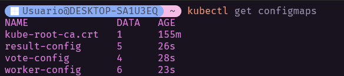

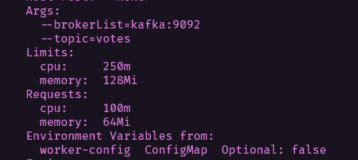

#### 5. Bulkhead

Límites de recursos (CPU y memoria) por servicio para aislar fallos y evitar que un servicio consuma todos los recursos del cluster.

| Servicio | CPU Request | CPU Limit | Memoria Request | Memoria Limit |
|----------|------------|-----------|----------------|--------------|
| vote     | 100m       | 500m      | 256Mi          | 512Mi        |
| worker   | 100m       | 250m      | 64Mi           | 128Mi        |
| result   | 100m       | 250m      | 128Mi          | 256Mi        |

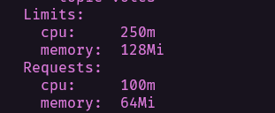

---

## 4. Diagrama de Arquitectura (15%)

[link al diagrama](https://drive.google.com/file/d/1VE8-4eg1-OgAHoyn4gc2xBMbKGFkjWXT/view?usp=sharing)

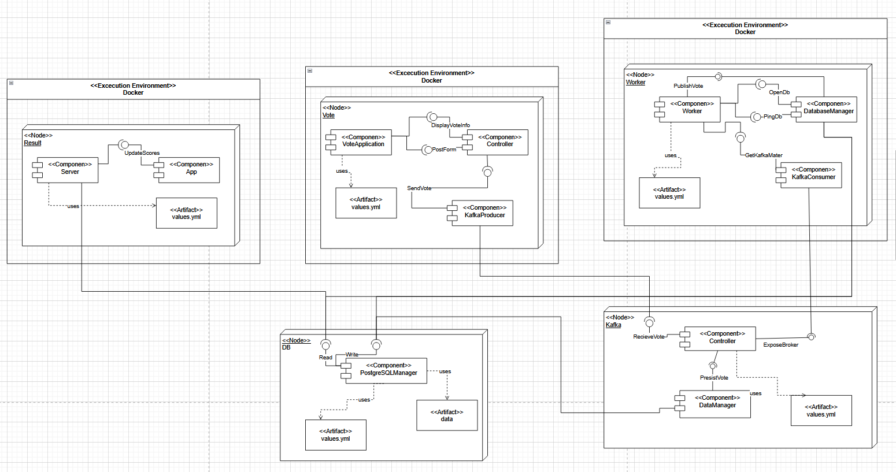

### Diagramas de los patrones implementados

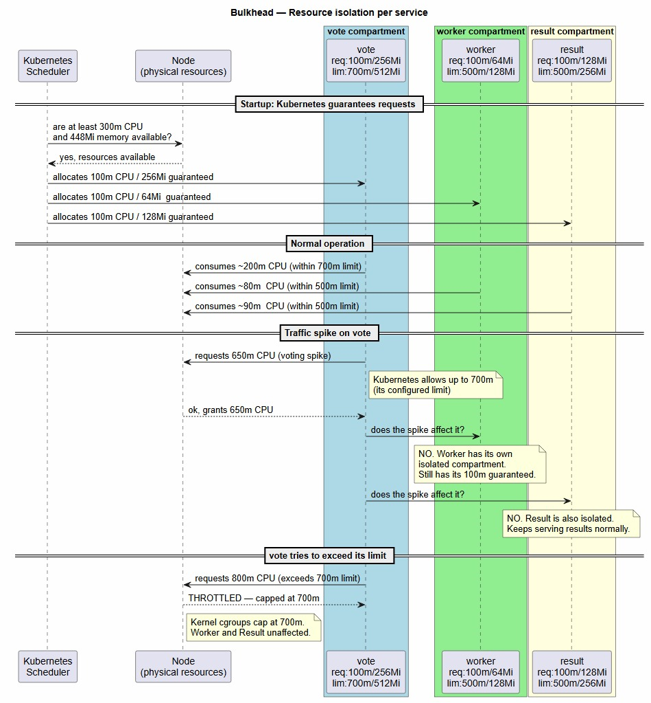

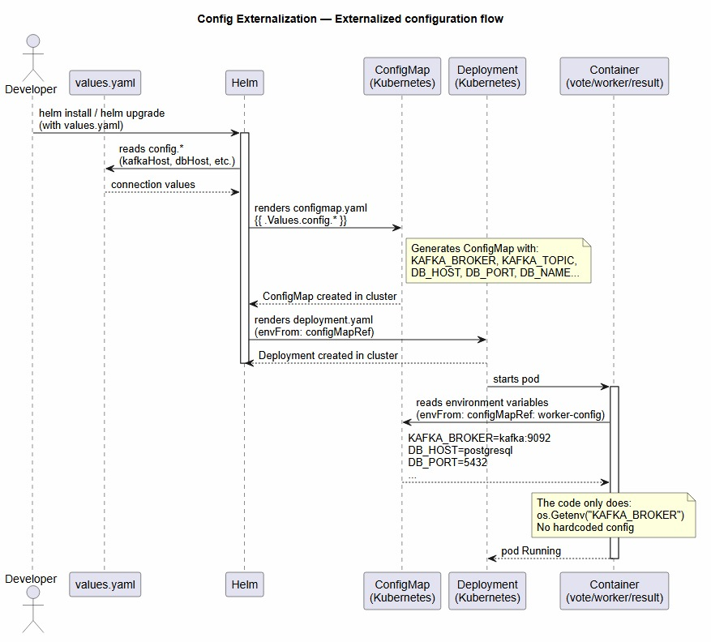
---

## 5. Pipelines de Desarrollo (15%)

Se crearon 3 workflows de GitHub Actions, uno por servicio. Cada workflow se dispara cuando hay cambios en el directorio del servicio correspondiente.

### vote-ci.yml — Servicio Vote (Java / Spring Boot)

**Trigger:** Push a `main`, `develop`, `feature/**`, `release/**`, `hotfix/**` con cambios en `vote/**`

| Job | Pasos |
|-----|-------|
| Build & Test | Checkout → Setup Java 22 → `mvn test` → `mvn package` |
| Build & Push Docker Image | Login ghcr.io → Build imagen → Push a `ghcr.io/electromayonaise/microservices-demo/vote:{branch}` |

### worker-ci.yml — Servicio Worker (Go)

**Trigger:** Push a `main`, `develop`, `feature/**`, `release/**`, `hotfix/**` con cambios en `worker/**`

| Job | Pasos |
|-----|-------|
| Build & Lint | Checkout → Setup Go 1.24 → `go mod tidy` → `go vet ./...` → `go build` |
| Build & Push Docker Image | Login ghcr.io → Build imagen → Push a `ghcr.io/electromayonaise/microservices-demo/worker:{branch}` |

### result-ci.yml — Servicio Result (Node.js)

**Trigger:** Push a `main`, `develop`, `feature/**`, `release/**`, `hotfix/**` con cambios en `result/**`

| Job | Pasos |
|-----|-------|
| Install & Audit | Checkout → Setup Node 22 → `npm install` → `npm audit --audit-level=high` |
| Build & Push Docker Image | Login ghcr.io → Build imagen → Push a `ghcr.io/electromayonaise/microservices-demo/result:{branch}` |

> **Nota:** Durante el desarrollo, el audit detectó una vulnerabilidad real (`CVE path-to-regexp ReDoS`) en `express 4.21.2`. Se actualizó a `express 4.22.1` como parte del proceso CI.

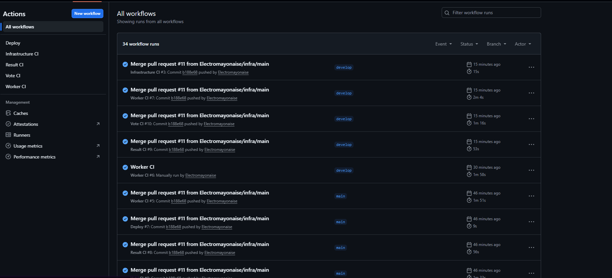
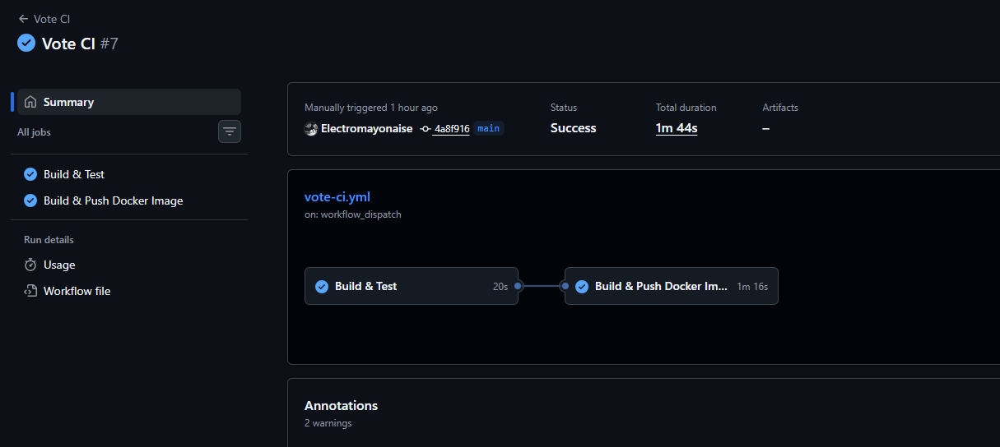

---

## 6. Pipelines de Infraestructura (5%)

### infra-ci.yml — Validación de Helm Charts

**Trigger:** Push a `infra/**` o `develop` con cambios en charts; PR hacia `main` o `infra/main`

| Job | Pasos |
|-----|-------|
| Helm Lint | `helm lint` en los 4 charts (infrastructure, vote, worker, result) |
| Helm Template Validation | `helm template` para verificar que los templates renderizan YAML válido |

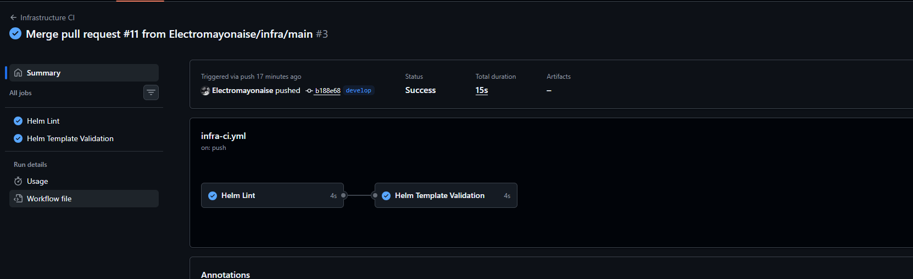

### deploy.yml — Deploy a Producción

**Trigger:** Push a `main`

Valida los charts y genera un resumen con las imágenes listas para despliegue. El deploy al cluster se realiza con el script `scripts/deploy-local.sh`.

---

## 7. Implementación de Infraestructura (20%)

La aplicación se desplegó en un cluster de **Kubernetes local usando kind** (Kubernetes in Docker).

### Stack desplegado

| Componente | Imagen | Helm Chart |
|-----------|--------|-----------|
| Kafka | apache/kafka:3.7.0 | `infrastructure/` |
| PostgreSQL | postgres:16 | `infrastructure/` |
| vote | ghcr.io/electromayonaise/microservices-demo/vote:develop | `vote/chart/` |
| worker | ghcr.io/electromayonaise/microservices-demo/worker:develop | `worker/chart/` |
| result | ghcr.io/electromayonaise/microservices-demo/result:develop | `result/chart/` |

### Comandos de despliegue

```bash
# Crear cluster
kind create cluster --name microservices-demo

# Desplegar toda la aplicación
bash scripts/deploy-local.sh electromayonaise develop

# Acceder a la aplicación
kubectl port-forward svc/vote 9090:8080    # App de votación
kubectl port-forward svc/result 9091:80   # Resultados en tiempo real
```

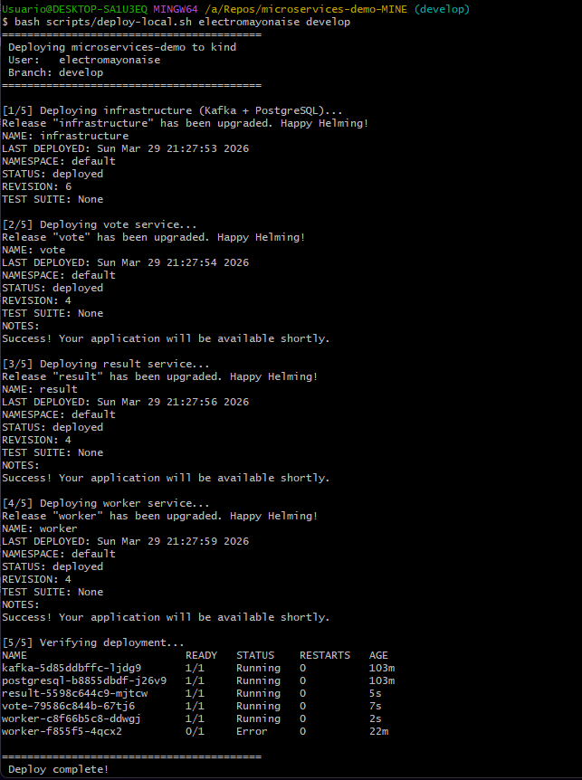

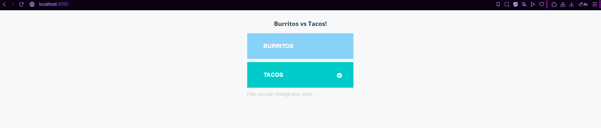

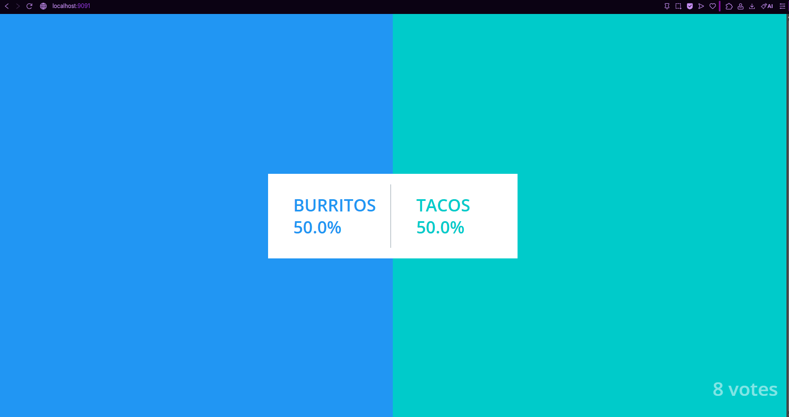
---

## 8. Demostración en Vivo

### Flujo a demostrar (8 minutos)

**1. Mostrar la arquitectura** (1 min)
- Diagrama de arquitectura
- Los 3 servicios corriendo en el cluster: `kubectl get pods`

**2. Demostrar el flujo Gitflow** (2 min)
- Crear rama `feature/demo-change` desde `develop`
- Hacer un cambio pequeño en `vote/src/main/resources/templates/index.html`
- Push de la rama → mostrar en GitHub Actions que `Vote CI` corre automáticamente
- Esperar que pase (build + test + docker push)

**3. Demostrar el flujo GitOps** (1 min)
- Mostrar las ramas `infra/staging` e `infra/main` en GitHub
- Mostrar el PR de infraestructura que corrió `Infrastructure CI` con helm lint

**4. Mostrar los patrones** (2 min)
- `kubectl get configmaps` → Config Externalization
- `kubectl describe deployment worker` → Bulkhead (Limits/Requests)
- Explicar brevemente los patrones existentes (Kafka, microservicios, retry)

**5. Mostrar la app funcionando** (2 min)
- Abrir `http://localhost:9090` → votar
- Abrir `http://localhost:9091` → ver resultados actualizarse en tiempo real

---

## 9. Tablero Kanban

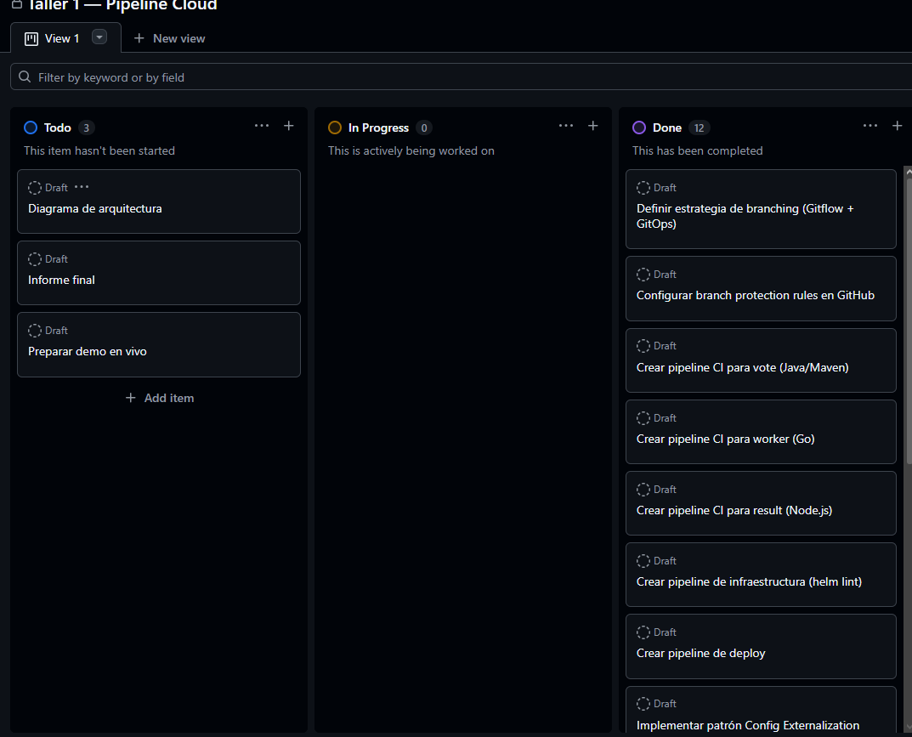
---

## Resumen de archivos creados

| Archivo | Descripción |
|---------|------------|
| `.github/workflows/vote-ci.yml` | Pipeline CI para el servicio vote |
| `.github/workflows/worker-ci.yml` | Pipeline CI para el servicio worker |
| `.github/workflows/result-ci.yml` | Pipeline CI para el servicio result |
| `.github/workflows/infra-ci.yml` | Pipeline de validación de infraestructura |
| `.github/workflows/deploy.yml` | Pipeline de deploy al mergear a main |
| `scripts/deploy-local.sh` | Script de deploy al cluster kind local |
| `docs/branching-strategy.md` | Documentación de estrategias de branching |
| `docs/cloud-patterns.md` | Documentación de patrones de diseño de nube |
| `docs/informe.md` | Este informe |
